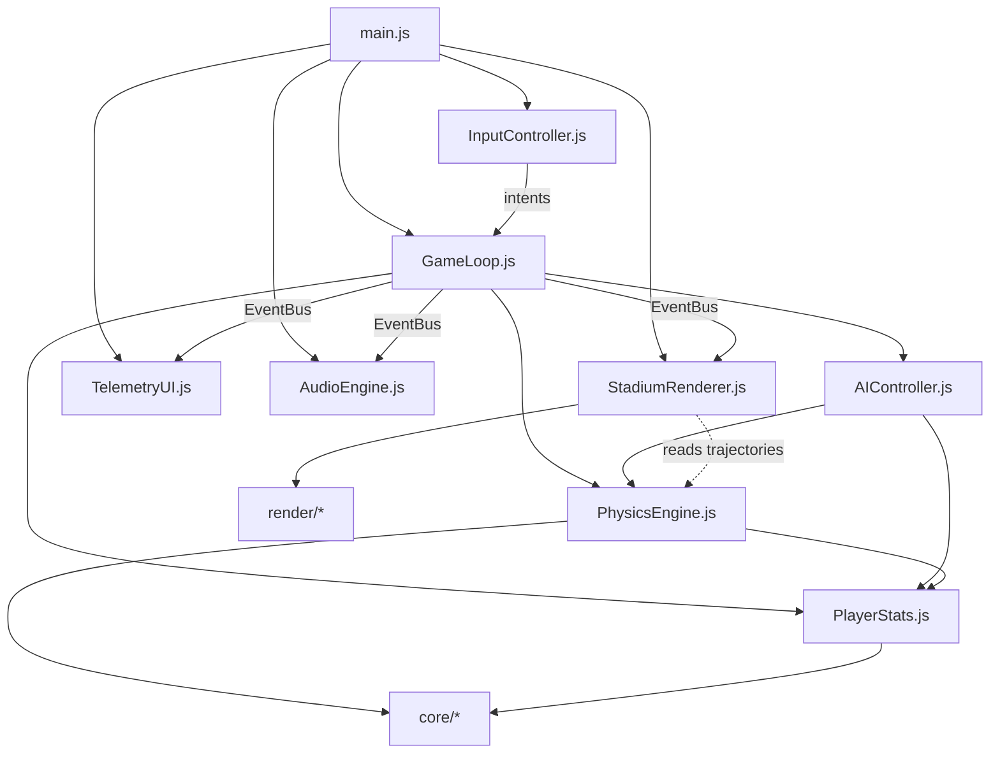
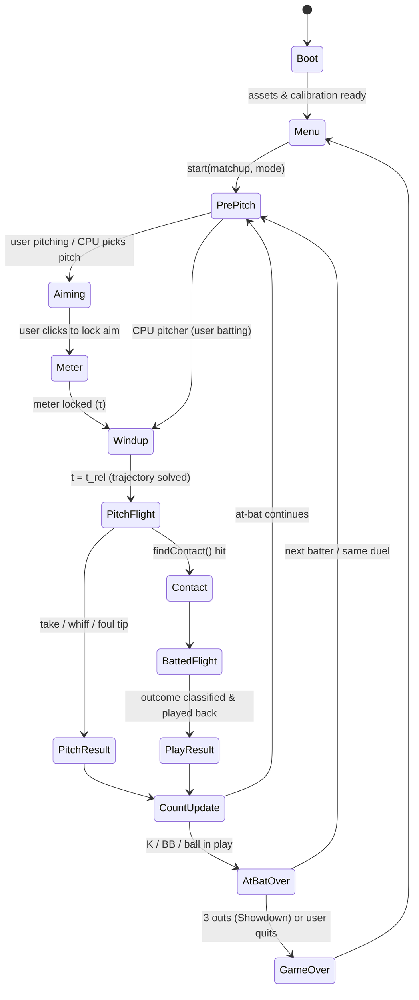

# Pitcher vs. Batter — Architecture & Implementation Blueprint

> Status: **design only**. This document fixes the project layout, the physics math, the data
> contracts and a step-by-step build plan for every module. Implementation files are written
> against it in the next phase.
>
> The HUD look comes from [`reference/statcast_boilerplate.html`](../reference/statcast_boilerplate.html).

---

## 0. Engineering decisions (fixed up front)

| Topic | Decision | Why |
|---|---|---|
| Runtime | Native ES modules, **no build step**. Three.js is pinned through an import map (`three@0.170.0` from jsDelivr), and an optional `vendor/` copy supports offline play. | You can start it with `python3 -m http.server 8080` or `npx serve .`. |
| Renderer | **WebGL2 `WebGLRenderer` ships first.** `WebGPURenderer` is opt-in with `?gpu=webgpu`, behind a `RendererFactory`. | WebGL2 has mature shadow and post-processing paths. On the WebGPU path, `ShaderMaterial` and `EffectComposer` don't work, so all custom visuals use built-in materials and the post-processing chain is swapped per backend. |
| Physics | A **pure, dependency-free** module (no Three.js imports) using SI units, `Float64Array` state and fixed-step RK4. It runs in Node too. | Deterministic, unit-testable with `node --test`, and replays are bit-exact. |
| Simulation style | Each trajectory is **solved once at the event** (release or contact) at 1 ms steps, then **played back** by the renderer at display rate with interpolation. | Telemetry (distance, plate location) is known instantly, the same way Statcast projects it, so there's no frame-rate dependence and contact detection becomes an exact search on a sampled path. |
| Randomness | A seeded `mulberry32` RNG is passed explicitly. | Reproducible at-bats, replays and tests. |
| HUD | DOM overlay styled with **static CSS** (`styles/hud.css`) that ports the boilerplate's Tailwind look. | The Tailwind browser JIT isn't meant for production and would compile CSS during gameplay. |
| Data units | The roster is stored in **baseball units** (mph, rpm, ft, in) and converted once at load by `core/units.js`. | Data stays readable and comparable to Baseball Savant. |
| Audio | Fully **synthesized with the Web Audio API** (no sample files). | No asset pipeline is needed, and every sound is shaped by the physics (EV, contact quality, pitch speed). |

---

## 1. Project layout

```
baseball/
├── index.html                  # Canvas + HUD DOM skeleton, import map, boot <script type="module">
├── package.json                # Scripts only: "start", "test" (no runtime deps)
├── README.md                   # Quick start + controls
├── styles/
│   └── hud.css                 # StatCast overlay styles (ported from the boilerplate)
├── src/
│   ├── main.js                 # Bootstrap: feature-detect, construct modules, wire event bus, start loop
│   ├── GameLoop.js             # State machine, fixed-step clock, rules (count/outs/runs), orchestration
│   ├── PhysicsEngine.js        # Aerodynamics ODE, RK4, Magnus/SSW, release solver, swing model,
│   │                           #   bat–ball collision, batted-ball flight, outcome classification
│   ├── PlayerStats.js          # MLB roster DB, ratings, rating→physics curves, strike-zone per batter
│   ├── StadiumRenderer.js      # Facade: renderer, scene, PBR, lights, cameras, playback, particles
│   ├── TelemetryUI.js          # StatCast overlay, scoreboard, arsenal, meters, PCI/aim reticles
│   ├── AudioEngine.js          # Web Audio synthesis: bat crack, glove pop, whoosh, crowd, umpire
│   ├── InputController.js      # Mouse/touch/keyboard → semantic intents (aim, swing, select pitch)
│   ├── AIController.js         # CPU pitcher (pitch + location) and CPU batter (recognition, timing)
│   ├── core/
│   │   ├── vec3.js             # Allocation-free Float64 vector ops for physics
│   │   ├── units.js            # MPH, FT, IN, RPM conversions
│   │   ├── rng.js              # mulberry32, gaussian (Box–Muller), seeded helpers
│   │   ├── EventBus.js         # Tiny typed pub/sub
│   │   └── constants.js        # Physical constants & field dimensions (single source of truth)
│   └── render/
│       ├── RendererFactory.js  # WebGL2 / WebGPU construction + post-processing per backend
│       ├── FieldBuilder.js     # Grass, dirt, mound, plate, chalk, walls, foul poles
│       ├── StadiumBuilder.js   # Bowl, seats (instanced), crowd billboards, light towers, video board
│       ├── BallFactory.js      # Ball mesh, procedural stitch texture & normal map, trail
│       ├── Players.js          # Stylized pitcher/batter/catcher/umpire rigs + procedural animation
│       ├── Cameras.js          # Batting, pitching, chase, center-field, replay cameras + shake
│       ├── Particles.js        # Dust / chalk / dirt pool (PointsMaterial, RGBA vertex colors)
│       └── textures.js         # Canvas-generated textures (mow stripes, dirt noise, seams)
├── tests/
│   ├── physics.test.js         # Benchmarks below (§2.11) — run with `node --test`
│   └── playerStats.test.js     # Roster schema & rating-curve monotonicity
├── docs/
│   └── ARCHITECTURE.md         # (this file)
└── reference/
    └── statcast_boilerplate.html
```

### 1.1 Module dependency graph



Rules:
- `PhysicsEngine` and `PlayerStats` never import Three.js, the DOM or audio. `PhysicsEngine` imports only the pure unit-conversion and rating-curve helpers from `PlayerStats`.
- Only `GameLoop` mutates game state. Every other module reacts to bus events or exposes pure queries.
- `StadiumRenderer` reads trajectories (typed arrays) produced by physics. It never integrates anything.

### 1.2 Launch

```bash
python3 -m http.server 8080      # or: npx serve .
# open http://localhost:8080
npm test                         # node --test "tests/**/*.test.js"
```

---

## 2. Physics specification (PhysicsEngine.js)

### 2.1 Frames and units

**World frame (Three.js, right-handed, SI):**
- Origin: the back tip of home plate, at ground level.
- **+y** up.
- **−z** toward the pitcher. The rubber is at z = −18.44 m (60.5 ft).
- **+x** toward the first-base side, which is the catcher's right.

A ball traveling from the pitcher to the plate therefore has v_z > 0.

**Statcast ↔ world.** Statcast uses (x toward the catcher's right, y toward the pitcher, z up):

```math
\mathbf{p}_{world} = \mathbf{M}_{sw}\,\mathbf{p}_{sc},\qquad
\mathbf{M}_{sw}=\begin{bmatrix}1&0&0\\0&0&1\\0&-1&0\end{bmatrix},\qquad \det\mathbf{M}_{sw}=+1
```

**Conversions** (`core/units.js`): 1 mph = 0.44704 m/s · 1 ft = 0.3048 m · 1 in = 0.0254 m · 1 rpm = 2π/60 rad/s.

**Handedness signs:** h_b = +1 for a right-handed batter (stands on the −x side), −1 for a left-handed batter. h_p = +1 for a right-handed pitcher, −1 for a left-handed pitcher. A pitcher's **arm side** is the −h_p·x direction.

### 2.2 Constants (`core/constants.js`)

| Symbol | Value | Meaning |
|---|---|---|
| m | 0.1453 kg | Ball mass (5.125 oz) |
| r | 0.03689 m | Ball radius (9.125 in circumference) |
| A | πr² = 4.275×10⁻³ m² | Cross-section |
| ρ₀ | 1.225 kg/m³ | Air density at sea level, 15 °C |
| K | ρA / 2m = **0.01802 m⁻¹** (at ρ₀) | Aerodynamic constant |
| g | (0, −9.80665, 0) m/s² | Gravity |
| C_D0, C_Dω | 0.3008, 0.0292 | Drag model (Nathan) |
| τ_ω | 25 s | Spin-decay time constant |
| k_I | 0.40 | Ball moment of inertia, I = k_I·m·r² |
| Bat | L = 0.864 m (34 in), M = 0.907 kg (32 oz), r_bat = 0.0330 m, knob→CM x_cm = 0.57 m, I_cm = 0.048 kg·m², sweet spot s_ss = 0.70 m from the knob | Wood bat |
| Plate | 17 in wide; front edge at z = −0.4318 m | Strike-zone plane |

**Air density** (park and weather):

```math
\rho = \frac{p_0\,e^{-h/8434}}{R_d\,(T_C+273.15)}\left(1-0.378\,\frac{\phi\,e_s(T_C)}{p}\right),\quad p_0=101325\text{ Pa},\; R_d=287.05
```

Then K = ρA/2m. Coors-like altitude (h = 1580 m) gives about 18 % less drag and lift. That shows up directly in the projected distance.

### 2.3 State vector and equations of motion

State **X** = [**p**, **v**, **ω**]ᵀ ∈ ℝ⁹. Air-relative velocity is **u** = **v** − **w**_wind, with U = |**u**| and û = **u**/U.

```math
\frac{d}{dt}\begin{bmatrix}\mathbf p\\ \mathbf v\\ \boldsymbol\omega\end{bmatrix}
=\begin{bmatrix}
\mathbf v\\[2pt]
\mathbf g\;-\;K\,C_D\,U\,\mathbf u\;+\;k_M\,K\,C_L(S)\,\dfrac{U}{\lvert\boldsymbol\omega_\perp\rvert}\,[\boldsymbol\omega]_\times\,\mathbf u\;+\;\mathbf a_{SSW}\\[10pt]
-\boldsymbol\omega/\tau_\omega
\end{bmatrix}
```

The pieces of that equation are defined as follows.

**Cross-product matrix:**

```math
[\boldsymbol\omega]_\times=\begin{bmatrix}0&-\omega_z&\omega_y\\ \omega_z&0&-\omega_x\\ -\omega_y&\omega_x&0\end{bmatrix}
```

**Transverse (Magnus-active) spin:**

```math
\boldsymbol\omega_\perp=\left(\mathbf I_3-\hat{\mathbf u}\hat{\mathbf u}^{\mathsf T}\right)\boldsymbol\omega
```

Gyro spin (spin parallel to **u**) produces no lift. Note that |[ω]× **u**| = |ω⊥|·U, so the Magnus term has magnitude exactly k_M·K·C_L·U², and it points along ω̂⊥ × û.

**Spin factor:**

```math
S=\frac{r\,\lvert\boldsymbol\omega_\perp\rvert}{U}
```

**Lift coefficient** (Nathan hyperbolic fit, saturates at large S):

```math
C_L(S)=\frac{1}{2.32+0.4/S}=\frac{S}{0.4+2.32\,S}
```

**Drag coefficient:**

```math
C_D=C_{D0}+C_{D\omega}\cdot\frac{\lvert\boldsymbol\omega\rvert_{rpm}}{1000}
```

**Magnus multiplier for pitches:** k_M = c_pitch · k_B(Break) · (1 + ξ). Here c_pitch is the per-pitch calibration constant (§2.5), k_B is the Break-rating multiplier (§4.3), and ξ ~ 𝒩(0, σ_mov) is pitch-to-pitch variance. For batted balls, k_M = 1.

**Seam-shifted wake (SSW)** is the non-Magnus movement that drives splinkers, sinkers and sweepers:

```math
\mathbf a_{SSW}=k_B\,K\,C_{SSW}\,U^2\;\mathbf F(\hat{\mathbf u})\begin{bmatrix}\sin\beta_s\\ \cos\beta_s\\ 0\end{bmatrix}
```

C_SSW comes from calibration (typically 0 to 0.06) and β_s is its tilt. **F** is the flight frame defined in §2.4, re-evaluated from the current û at every step.

Sanity checks (verified in the prototype):
- At 40 m/s with C_D = 0.35, drag deceleration is 10.1 m/s² (about 1 g).
- A spinless 95 mph release arrives at **87.6 mph** at the front of the plate, a loss of 7.8 %, which matches real Statcast.

### 2.4 Spin vector from Statcast-style inputs

**Flight frame matrix.** Columns are right, up and forward relative to the flight direction f̂:

```math
\hat{\mathbf e}_2=\frac{\hat{\mathbf y}-(\hat{\mathbf y}\cdot\hat{\mathbf f})\hat{\mathbf f}}{\lVert\cdot\rVert},\qquad
\hat{\mathbf e}_1=\hat{\mathbf e}_2\times\hat{\mathbf f},\qquad
\mathbf F(\hat{\mathbf f})=\begin{bmatrix}\hat{\mathbf e}_1 & \hat{\mathbf e}_2 & \hat{\mathbf f}\end{bmatrix}
```

For f̂ = +ẑ, this gives **F** = **I₃**: ê₁ = +x is the catcher's right and ê₂ = +y is up.

**Tilt β.** β is the direction of the Magnus force as seen by the catcher, measured clockwise from 12:00. β = 0 is pure backspin (ride), β = π is pure topspin, and β > 0 pushes toward +x.

Converting from Baseball Savant's spin-axis angle φ_sv (180° = pure backspin; a typical right-handed 4-seam is about 200–230°):

```math
\beta=\pi-\varphi_{sv}
```

For example, a right-handed 4-seam with φ_sv = 210° gives β = −30°: ride plus run toward −x, which is arm side for a right-hander.

**Spin vector.** Inputs are total spin Ω (rad/s), spin efficiency ε ∈ [0, 1] (Statcast's "active spin") and gyro sign s_g = ±1:

```math
\boxed{\;\boldsymbol\omega_0=\Omega\;\mathbf F(\hat{\mathbf f}_0)\begin{bmatrix}-\varepsilon\cos\beta\\ \;\;\varepsilon\sin\beta\\ s_g\sqrt{1-\varepsilon^2}\end{bmatrix}\;}
```

Proof sketch for f̂ = ẑ: the transverse part is ω⊥ ∝ (−cos β, sin β, 0). Then

```math
\boldsymbol\omega_\perp\times\hat{\mathbf z}=(\sin\beta,\ \cos\beta,\ 0)
```

which is exactly the force direction defined by β. As a check, β = 0 gives ω = −x̂. The top of the ball then moves toward −z, which is backspin.

### 2.5 Per-pitch calibration to real movement

The C_L fit carries about ±15 % scatter in the literature. To make each pitch reproduce its real-world **IVB/HB** exactly, `calibratePitch()` runs once at load and caches the results.

1. **Define movement as Statcast does.** Movement is the plate-crossing displacement (at the z = −0.4318 m plane) relative to a **spinless** trajectory with the same release state, so gravity and drag cancel out:

   ```math
   \Delta\mathbf p(c,\varepsilon,\beta)=\mathbf p_{plate}^{spin}-\mathbf p_{plate}^{spinless}
   ```

   IVB is Δp_y and the world horizontal break is Δp_x. The data stores HB as arm-side positive, HB_arm, which converts as follows:

   ```math
   \Delta p_x^{target}=-h_p\cdot \mathrm{HB}_{arm}
   ```

2. **Direction.** Set the direction from the target:

   ```math
   \beta^{*}=\operatorname{atan2}\!\left(\Delta p_x^{target},\ \mathrm{IVB}^{target}\right)
   ```

3. **Magnitude.** If `activeSpin` is known, fix ε to it. Otherwise solve |Δp|(ε) = |Δp_target| by secant iteration on ε (monotone, 3 to 5 iterations), with c_pitch = 1.

4. **Residual.**
   - If the solved ε would exceed 1, or the data's `activeSpin` leaves a residual, attribute the remainder to SSW. Solve (C_SSW, β_s) with a 2×2 Newton step on the residual vector.
   - If the residual is already small but the direction is off by more than 3°, refine (β, c_pitch) with the same 2×2 Newton step.

   This is how low-spin, high-movement pitches such as Skenes' splinker get their physically correct mechanism.

5. **Store the result:** `{ eps, beta, cPitch, cSSW, betaSSW }`. Calibration runs with k_B(B_ship) included, so **with shipped ratings the sim reproduces the real pitch**. Rating changes, fatigue or difficulty then scale the movement through k_B (§4.3).

Prototype reference points, before calibration:
- **4-seam:** 95 mph, 2400 rpm, ε = 0.92 → IVB = 19.3 in.
- **Curveball:** 82 mph, 2700 rpm, ε = 0.80, β = 150° → IVB = −20.1 in and +12.3 in glove-side.

Calibration pulls both to their stored targets.

### 2.6 Integrator

Classic RK4 with a fixed step h = 1 ms for pitches. Batted balls use h = 2 ms, and h = 1 ms within 0.2 s of any ground or wall event. The Butcher tableau:

```math
\begin{array}{c|cccc}0&&&&\\ \tfrac12&\tfrac12&&&\\ \tfrac12&0&\tfrac12&&\\ 1&0&0&1&\\\hline &\tfrac16&\tfrac13&\tfrac13&\tfrac16\end{array}
\qquad
\mathbf X_{n+1}=\mathbf X_n+\tfrac{h}{6}(\mathbf k_1+2\mathbf k_2+2\mathbf k_3+\mathbf k_4)
```

**Event location.** When a stop predicate crosses between steps (plate plane, ground y = r, wall radius), linearly interpolate the step fraction:

```math
s=\frac{z^*-z_n}{z_{n+1}-z_n}
```

This is cubic-Hermite-accurate enough at 1 ms, where the error is below 0.1 mm.

**Output.** A `Trajectory` holding `t: Float64Array`, `p/v/w: Float64Array(3N)` and event markers. A pitch is about 420 samples. The renderer samples it with Hermite interpolation using p and v.

### 2.7 Release solver (aiming)

Given release point **p₀**, speed s, the pitch's spin parameters and a plate target **T** = (T_x, T_y), find the release angles (θ = elevation, φ = azimuth):

```math
\hat{\mathbf f}_0(\theta,\varphi)=\begin{bmatrix}\sin\varphi\cos\theta\\ \sin\theta\\ \cos\varphi\cos\theta\end{bmatrix},\qquad
\mathbf v_0=s\,\hat{\mathbf f}_0
```

Solve **P**(θ, φ) = **T** with Newton's method, using a finite-difference Jacobian (δ = 10⁻⁴ rad):

```math
\mathbf J=\begin{bmatrix}\partial P_x/\partial\varphi & \partial P_x/\partial\theta\\ \partial P_y/\partial\varphi & \partial P_y/\partial\theta\end{bmatrix},\qquad
\begin{bmatrix}\Delta\varphi\\ \Delta\theta\end{bmatrix}=\mathbf J^{-1}(\mathbf T-\mathbf P)
```

**Initial guess:** a straight line to T with a gravity-drop correction. This converges to below 10⁻¹² m in 3 to 4 iterations, at about 12 RK4 simulations per pitch, which takes under 2 ms.

**Control error** is applied to **T** before solving (§4.3), so a miss is a miss of the *intended* spot. The pitch still breaks naturally.

### 2.8 Swing kinematics (bat model)

The bat is a rigid cylinder swinging about a moving pivot (the hands' center of rotation). Let the pivot-to-sweet-spot radius be R_ss = ρ₀ + s_ss, with ρ₀ = 0.25 m, so R_ss = 0.95 m.

**Inputs.**
- PCI target **c** = (c_x, c_y) at the ideal contact depth z* = −0.45 m.
- Click time t_c.
- Swing duration T_sw = 0.150 s.
- Sweet-spot speed V_ss (§4.2).
- Attack angle α (per batter).
- Vertical bat angle (VBA, tip below the hands), which depends on pitch height:

  ```math
  \lambda(c_y)=-28^\circ+40^\circ/\mathrm m\cdot(c_y-0.75)
  ```

  The ball-height terms are clamped to [−45°, −12°].

**Yaw.** Yaw rate is Ω_s = V_ss/R_ss, about 36 rad/s for a 76 mph swing. Through the hitting zone the yaw is linear:

```math
\psi(t)=\Omega_s\,(t-t_c-T_{sw})
```

ψ = 0 means the bat is square to the plate. ψ > 0 means the barrel is out front, so the ball is pulled.

The linear part covers the last 50 ms before square and continues to ψ = 1.4 rad; contact is only possible for |ψ| ≤ 1.4. Before that, the bat accelerates uniformly from rest at the loaded position so its speed is continuous; after ψ = 1.4 it decelerates uniformly to a stop at 2.6 rad (follow-through). The renderer animates the bat from the same `pose(t)`.

**Bat axis** (knob → tip):

```math
\hat{\mathbf a}(t)=\mathbf R_y(h_b\psi)\begin{bmatrix}h_b\cos\lambda\\ \sin\lambda\\ 0\end{bmatrix},\qquad
\mathbf R_y(\theta)=\begin{bmatrix}\cos\theta&0&\sin\theta\\0&1&0\\-\sin\theta&0&\cos\theta\end{bmatrix}
```

**Pivot.** The pivot is chosen so the sweet spot passes through the PCI at ψ = 0. Through the zone the barrel rises along the plane of the pitch:

```math
\mathbf P=\mathbf c^{3D}-R_{ss}\,\hat{\mathbf a}(\psi{=}0)+\begin{bmatrix}0\\ R_{ss}\sin\psi(t)\,\tan\alpha_{rise}\\ 0\end{bmatrix},\qquad
\alpha_{rise}=0.7\,\mathrm{VAA}+0.3\,\alpha
```

VAA is the pitch's descent angle at z*. Real hitters largely match the plane of the pitch, so timing errors mostly change spray, not launch. Phase 1 testing showed that rising at the full attack angle turned a perfectly aimed swing 10 ms early into a topped grounder. The attack angle α still sets the bat's velocity direction in the collision.

**Velocity of a bat point** at distance s from the knob (horizontal normal **n̂**_h, tilted up by α):

```math
\hat{\mathbf n}_h=\begin{bmatrix}-h_b\sin\psi\\0\\-\cos\psi\end{bmatrix},\qquad
\mathbf V_{bat}(s)=V_{ss}\,\frac{\rho_0+s}{R_{ss}}\;\mathrm{normalize}\!\Big(\cos\alpha\,\hat{\mathbf n}_h+\sin\alpha\,\hat{\mathbf y}\Big)_{\perp\hat{\mathbf a}}
```

**Timing error.** Let t* be the time the ball crosses z*:

```math
\Delta t=(t_c+T_{sw})-t^{*}
```

Δt < 0 is early (pull side) and Δt > 0 is late (opposite field). Every 10 ms of timing error rotates the bat about 20°. In the engine that moves the spray angle by roughly 10–25°, plus hook or slice from the sidespin an angled bat imparts.

**Bat speed loss when mistimed:**

```math
f_t=\max\!\left(0.6,\;1-0.5\,(\Delta t/0.040)^2\right)
```

V_ss is multiplied by f_t, so a badly mistimed swing loses bat speed.

**Bat recoil mass.** The free-bat assumption holds over the roughly 1 ms collision. With b = |s − x_cm|:

```math
\frac{1}{M_e(s)}=\frac{1}{M}+\frac{b^2}{I_{cm}}
```

At the sweet spot, M_e = 0.687 kg and r_m = m/M_e = 0.211.

### 2.9 Contact detection (continuous, exact on the sampled path)

1. **Swing plane.** Define a signed function as the 2D cross product of the bat azimuth with the ball's horizontal offset from the pivot:

   ```math
   g(t)=\hat{\mathbf a}_{xz}(t)\times(\mathbf p_{ball}(t)-\mathbf P(t))_{xz}
   ```

   Bracket the sign change of g(t) over the pitch samples, then refine with bisection to 10 µs.

2. **Offsets at that instant.** Let **q** = **p**_ball − **P**.
   - Along-barrel position: s_c = **q**·**â** − ρ₀. If s_c < 0 or s_c > L, it's a whiff: the ball passes inside the hands or beyond the tip.
   - Barrel offset from the sweet spot: d = s_c − s_ss.
   - Relative velocity: **u** = **v**_ball − **V**_bat(s_c). Its part perpendicular to the bat:

     ```math
     \mathbf u_\perp=(\mathbf I-\hat{\mathbf a}\hat{\mathbf a}^{\mathsf T})\mathbf u
     ```

   - Cross-section "up" direction, which is independent of handedness:

     ```math
     \hat{\mathbf e}_D=\mathrm{normalize}\big((\mathbf I-\hat{\mathbf a}\hat{\mathbf a}^{\mathsf T}-\hat{\mathbf u}_\perp\hat{\mathbf u}_\perp^{\mathsf T})\,\hat{\mathbf y}\big)
     ```

   - **Impact parameter** (undercut, where + means the ball center is above the bat axis):

     ```math
     D=\mathbf q\cdot\hat{\mathbf e}_D
     ```

3. **Miss and foul-tip tests.** With R_Σ = r + r_bat = 0.0699 m:
   - |D| ≥ R_Σ → swinging strike.
   - R_Σ ≤ |D| < R_Σ + 0.006 m → **foul tip**. With two strikes it's caught and the batter strikes out. Otherwise it's a foul.

4. **Contact normal** (exact cylinder–sphere contact for the approach along **u**⊥), pointing from bat to ball:

```math
\hat{\mathbf n}=\frac{-\sqrt{R_\Sigma^2-D^2}\;\hat{\mathbf u}_\perp+D\,\hat{\mathbf e}_D}{R_\Sigma}
```

### 2.10 Bat–ball collision (impulse model in matrix form)

**Contact frame.** These columns are orthonormal by construction:

```math
\mathbf C=\begin{bmatrix}\hat{\mathbf a} & \hat{\mathbf t} & \hat{\mathbf n}\end{bmatrix},\qquad
\hat{\mathbf t}=\hat{\mathbf n}\times\hat{\mathbf a}
```

**Slip velocity** of the ball's contact point relative to the bat surface:

```math
\boldsymbol\sigma=\mathbf u+\boldsymbol\omega\times(-r\,\hat{\mathbf n}),\qquad \boldsymbol\sigma_L=\mathbf C^{\mathsf T}\boldsymbol\sigma\quad(\sigma_{L,3}<0\text{ required})
```

**Impulse.** The velocity change in local coordinates is a diagonal gain matrix:

```math
\Delta\mathbf v_L=-\underbrace{\begin{bmatrix}\kappa_t&0&0\\0&\kappa_t&0\\0&0&\kappa_n\end{bmatrix}}_{\mathbf K_c}\boldsymbol\sigma_L,\qquad
\kappa_n=\frac{1+e(d)}{1+r_m(s_c)},\quad \kappa_t=\frac{(1+e_T)\,k_I}{1+k_I}=\frac{2}{7}\ (e_T{=}0)
```

**Coulomb cap** (μ = 0.50): if ‖(Δv_L,1, Δv_L,2)‖ > μ|Δv_L,3|, scale the tangential part down to the cone.

**Outgoing state:**

```math
\mathbf v'=\mathbf v+\mathbf C\,\Delta\mathbf v_L,\qquad
\boldsymbol\omega'=\boldsymbol\omega-\frac{1}{k_I\,r}\,[\hat{\mathbf n}]_\times\,\mathbf C\,\Delta\mathbf v_L
```

**Coefficient of restitution** along the barrel (wood):

```math
e(d)=\max\!\left(0.10,\;e_0-5.0\,d^2\right)
```

e₀ = 0.46, so 6 in off the sweet spot gives e ≈ 0.35. Toward the hands the effective mass also changes, so jammed contact naturally loses exit velocity.

The normal component reproduces Nathan's 1D result, BBS = q·v_pitch + (1+q)·V_bat:

```math
q=\frac{e-r_m}{1+r_m}\approx0.21
```

Backspin from undercut, topspin from overcut and sidespin from barrel yaw all **emerge** from the tangential impulse. Nothing is scripted.

Engine results (Phase 1, sea level) for an 86 mph pitch arriving 31° downward, a 75 mph bat with α = 8°, and the approach taken along the relative velocity:

| D (mm) | EV (mph) | LA (°) | Spin (rpm) | Distance (ft) |
|---:|---:|---:|---:|---:|
| −15 | 110.7 | −7.7 | 3457 (top) | 20 (ground ball) |
| 0 | 107.9 | 8.7 | 657 (top) | 167 (liner) |
| +10 | 103.5 | 19.7 | 1209 | 374 |
| +18 | 98.6 | 28.8 | 2702 | 383 |
| +25 | 93.2 | 37.3 | 4009 | 339 |
| +35 | 83.5 | 50.5 | 5875 | 243 (pop-up) |

### 2.11 Batted-ball flight, ground, wall, outcome

**Flight.** The same ODE (§2.3) with a_SSW = 0, τ_ω = 25 s and k_M = 0.75 (`AIR.battedLiftScale`), integrated until y = r.

The batted-ball lift scale was fitted in Phase 1. With full Nathan lift, carry ran 15–30 ft long against typical Statcast distances (90 mph / 30° ≈ 330 ft, 95 / 30 ≈ 365, 100 / 28 ≈ 398, 105 / 28 ≈ 422, 110 / 28 ≈ 448, 100 / 20 ≈ 370, 95 / 15 ≈ 300). A 0.75 lift scale brings all seven within 16 ft (RMS 7 ft). Pitches are unaffected because each pitch is calibrated separately (§2.5).

**Ground bounce** in the contact frame of the ground (n̂ = ŷ):

```math
\mathbf v'=\begin{bmatrix}f_t&0&0\\0&-e_g&0\\0&0&f_t\end{bmatrix}\mathbf v,\qquad
f_t=\max\!\left(\tfrac{5}{7},\;1-\mu_g(1+e_g)\frac{\lvert v_y\rvert}{\lVert\mathbf v_{xz}\rVert}\right)
```

Use e_g = 0.45 and μ_g = 0.40 on grass, or e_g = 0.50 and μ_g = 0.30 on dirt. Spin halves at each bounce. After |v_y| < 0.5 m/s the ball rolls with deceleration a = μ_r·g + c_r·v², where μ_r = 0.25 and c_r = 0.015 m⁻¹ on grass, or μ_r = 0.35 and c_r = 0.006 m⁻¹ on dirt. Without the speed term, hard grounders rolled all the way to the wall.

The surface under the ball is dirt on the mound, the plate circle (13 ft), the infield skin (within 95 ft of the mound, outside the infield grass diamond) and the warning track (last 15 ft before the wall); grass everywhere else.

**Wall.** The park polygon gives the wall distance r_w(φ) and height h_w(φ), piecewise-linear in spray angle. The spray angle is φ = atan2(x, −z) (+ toward right field).
- **Home run:** the path crosses r = r_w(φ) with y > h_w(φ).
- **Off the wall:** the path hits the wall below h_w. Reflect the normal velocity with e_w = 0.30 and reduce the tangential part by 0.8.

**Statcast metrics.**

| Metric | Definition |
|---|---|
| Pitch Speed | \|v₀\| at release (mph, 1 decimal) |
| Spin Rate | \|ω₀\| (rpm) |
| Exit Velocity | \|v′\| immediately after contact |
| Launch Angle | asin(v′_y / \|v′\|) |
| Distance | Projected: horizontal \|(x, z)\| where the flight first reaches y = 0, ignoring walls and fielders. A second flight is simulated with no wall if needed. |

Extras: plate speed, IVB/HB, extension, plate time, hang time, apex, spray angle, barrel flag and xBA.

**Barrel flag.**

```math
\mathrm{EV}\ge98,\quad \mathrm{lo}=\max(8,\;26-(\mathrm{EV}-98)),\quad
\mathrm{hi}=\begin{cases}30+1.5(\mathrm{EV}-98)&\mathrm{EV}<100\\ \min(50,\;33+\tfrac{17}{16}(\mathrm{EV}-100))&\text{else}\end{cases}
```

**Outcome (fielder-kinematics model, deterministic).**

- **Fielders** sit at polar positions in ft and degrees: P (58, 0), 1B (110, +33), 2B (150, +17), SS (150, −17), 3B (115, −33), LF (290, −28), CF (320, 0), RF (290, +28).
- **Fielder time** to cover a distance d. Each fielder has a reaction time t_r, a reach radius ρ_f (glove plus dive), acceleration a and top speed v:

  ```math
  t_f(d)=t_r+\begin{cases}\sqrt{2d'/a}&d'\le v^2/2a\\ d'/v+v/2a&\text{otherwise}\end{cases},\qquad d'=\max(0,\;d-\rho_f)
  ```

  | Fielders | t_r (s) | ρ_f (m) | a (m/s²) | v (m/s) |
  |---|---|---|---|---|
  | Infielders | 0.20 | 1.6 | 6.0 | 7.6 |
  | Pitcher | 0.35 | 1.0 | 4.5 | 6.5 |
  | Outfielders | 0.45 | 0.9 | 4.5 | 8.2 |

- **Air catch:** scan the flight. At every sample where the ball is at or below 2.4 m, it's caught if some fielder's t_f is at most the elapsed time. Samples beyond the wall don't count. Foul balls count only within 15 m of the foul line. A catch is OUT_FLY for LA ≥ 25°, otherwise OUT_LINE.
- **Fair or foul:** decided where the ball first lands if that's beyond 90 ft (or where it hits the wall). Otherwise it's decided where the ball passes 90 ft, or where it stops. A ball is fair when |φ| ≤ 45°.
- **On the ground:** the first fielder able to reach the ball's path (ball at or below 2.4 m) fields it.
  - **Infielder:** out if the field time + 0.6 s transfer + throw to first at 38 m/s is no later than the batter's time to first (4.25 s right-handed, 4.10 s left-handed). Otherwise it's an infield single.
  - **Outfielder** (or nobody, in which case the nearest outfielder picks it up at rest): the batter takes 2B or 3B while the throw would arrive late. The outfielder's throw is 1.0 s pickup + distance at 30 m/s effective. Each base takes 3.9 s more, and the runner wants a 0.3 s margin.

**Calibration check (Phase 1).** I simulated 4,000 batted balls from an MLB-like distribution (LA ~ 𝒩(12°, 26°), EV ~ 𝒩(95 − 0.012(LA − 12)², 10) mph, spray ~ 𝒩(0, 26°)):

| Measure | Simulated | MLB |
|---|---|---|
| Barrel rate | 6.5% | ~7% |
| HR per barrel | 0.67 | ~0.55–0.6 |
| Ground-ball hit rate | 0.28 | ~0.24 |
| Line-drive hit rate | 0.55 | ~0.68 |
| BABIP | .254 | ~.290 |

The test distribution's wide spray sends many fly balls toward the 330 ft foul lines, so its overall HR rate (8%) overstates what real swings will produce. Revisit once real swing data from Phase 4 is available.

**Physics tests** (`tests/physics.test.js`, 30 tests):

| Case | Expected |
|---|---|
| Spinless 95 mph release, 54 ft → plate | Plate speed 87.6 ± 0.3 mph; flight time 0.395 ± 0.01 s |
| Release solver | Plate error < 1 mm after ≤ 5 iterations |
| Calibration | Every roster pitch, thrown, shows its published IVB and HB within 0.5 in |
| 100 mph, 28°, 2000 rpm backspin, sea level | 392 ± 12 ft, hang 4.9 ± 0.3 s |
| 110 mph, 28°, 2500 rpm | 435 ± 12 ft |
| Carry vs Statcast references | Each within 20 ft, RMS < 10 ft |
| Head-on sweet-spot collision (86 mph pitch, 75 mph bat, D = 0) | EV 107.9 ± 1 mph |
| Undercut sweep D: −15 → +35 mm | Launch angle increases monotonically; undercut gives backspin |
| Mirror symmetry | A left-handed batter against a mirrored left-handed pitcher gives the same EV/LA and mirrored spray (to 10⁻⁶) |
| Energy | Outgoing kinetic energy in the bat frame never exceeds incoming |
| Timing | Early pulls and late goes the other way, for both batting sides |
| PCI height, Contact, power swing | Undercut lifts; higher Contact absorbs more error; power swing adds EV but shrinks the PCI by 20% |
| Outcomes | HR, pop-up out, routine grounder to SS, foul, gap double, routine fly out |
| Also | Spin construction, Savant conversion, altitude, Break scaling, velocity cap, determinism, dirt bounces, zone edges, trajectory sampling, barrel/xBA |

### 2.12 Visual ball spin (render side, documented here because it's derived from ω)

Orientation quaternion update per frame, where ω is taken from the trajectory sample:

```math
\mathbf q_{k+1}=\mathbf q_k\otimes\Big[\cos\tfrac{\lVert\boldsymbol\omega\rVert\Delta t}{2},\ \hat{\boldsymbol\omega}\sin\tfrac{\lVert\boldsymbol\omega\rVert\Delta t}{2}\Big]
```

At 2400 rpm (40 rev/s) and 60 fps, the ball turns 240° per frame, which aliases into a wagon-wheel effect. To avoid that, render the **true axis** with a **visual rate** ‖ω‖_vis = min(‖ω‖, 2π·9 rad/s) during live play, and add a seam motion-blur blend. Replays at 1/8 speed and below show the true rate, so you can see the real seam orientation, including 4-seam vs. 2-seam presentation and the gyro "dot" on sliders.

---

## 3. Step-by-step blueprint: `PhysicsEngine.js`

> Pure ES module. Depends only on `core/vec3.js`, `core/constants.js`, `core/units.js` and `core/rng.js`.
> No allocations in hot loops: preallocate scratch `Float64Array`s per call.

1. **Imports and scratch buffers.** Declare module-level scratch vectors (`_u`, `_wp`, `_tmp`) and a reusable `k1..k4` derivative buffer (`Float64Array(9)` each).
2. **`createEnvironment({ altitudeM=0, tempC=21, humidity=0.5, windMps=[0,0,0] })`.** Returns `{ rho, K, wind }`, using the density formula in §2.2.
3. **`cl(S)`, `cd(omegaRpm)`.** Coefficient functions from §2.3. Export them for tests.
4. **`derivative(X, params, out)`.** Writes Ẋ for the 9-state:
   - **u** = **v** − wind.
   - Drag term.
   - **ω**⊥ via the projector (skip the Magnus term if |**ω**⊥| < 1e-6).
   - Magnus term with `params.kM`.
   - SSW term using `flightFrame(û)` with `params.cSSW` and `params.betaSSW`.
   - Spin decay.
5. **`rk4Step(X, h, params)`.** In-place RK4 using the scratch k-buffers.
6. **`simulate(X0, params, stop, { h, maxT, record=true })`.** Loops `rk4Step`. After each step it evaluates `stop(Xprev, X)`, which returns `null` or a fraction s ∈ [0, 1]. It writes the interpolated terminal sample and returns `Trajectory { t, p, v, w, n, events[] }`, using geometric growth for typed arrays.
7. **`flightFrame(fHat, out3x3)`.** Builds **F** per §2.4.
8. **`spinVector(rpm, eps, beta, gyroSign, fHat)`.** Applies the boxed formula in §2.4.
9. **`pitchParams(pitch, pitcher, env, ratingCtx)`.** Assembles `{ kM: cPitch*kB*(1+xi), cSSW, betaSSW, K, wind }` from the cached calibration and current ratings.
10. **`movementVsSpinless(release, pitchParams)`.** Runs two simulations (spin and spinless) and returns `{ ivbIn, hbArmIn }` at the plate plane.
11. **`calibratePitch(pitch, pitcher, env)`.** Implements §2.5: a secant search on ε, then 2×2 Newton for the SSW residual or a (β, c) refinement. Results are memoized by `pitcher.id + pitch.code`.
12. **`solveRelease({ p0, speed, spin, params, target })`.** Implements the Newton aiming in §2.7. Returns `{ v0, w0, traj, iterations, residual }`.
13. **`controlScatter(target, meter, pitcher, rng)`.** Applies the formulas in §4.3 and returns the perturbed target plus `{ sigmaIn, biasIn }` for UI feedback.
14. **`plateCrossing(traj)` / `isStrike(cross, zone)`.** A strike is any part of the ball touching the zone at the front plane: |x| ≤ 0.2159 + r and y ∈ [zone.bot − r, zone.top + r].
15. **`class SwingModel`.**
    - Constructor `(batter, ratings, hb, pciWorld, tClick, vss, alpha)`. It applies the Contact correction from §4.2 to the PCI target, then fixes λ and **P**.
    - `pose(t)` returns `{ psi, aHat, pivot, sweetSpot, knob, tip }`. The renderer animates the bat mesh with this exact function, so visuals and physics never disagree.
16. **`findContact(pitchTraj, swing)`.** Implements the bracketing and bisection in §2.9. Returns `{ tC, sAlong, d, D, nHat, uPerp, kind: 'contact'|'foulTip'|'whiff' }`.
17. **`resolveCollision(ballState, swing, contact)`.** Implements §2.10. Returns `{ v, w, ev, la, sprayDeg, sweetSpotPct, e, Me }`, where `sweetSpotPct = 100·exp(−(d/0.07)²)` feeds the play text.
18. **`simulateBattedBall(contactState, env, park)`.** Flight plus bounces, wall and roll (§2.11). Returns `{ flight, roll, landing, apexFt, hangS, projectedDistFt, wallEvent, isHR }`.
19. **`classifyOutcome(batted, park, fielders, battedBy, rng)`.** Returns one of `'HR'|'3B'|'2B'|'1B'|'OUT_FLY'|'OUT_LINE'|'OUT_GROUND'|'FOUL'`, plus the fielder involved (used for the camera and play text).
20. **`statcastMetrics(pitch, contact?, batted?)`.** Builds the telemetry payload (§6.3), including barrel and xBA. xBA comes from a 2D lookup over (EV, LA) bins in 3 mph × 4° steps, embedded as a small table.

---

## 4. Player data & attribute system

### 4.1 Schema (`PlayerStats.js`)

```js
/** @typedef {{ vsL:number, vsR:number }} Split */
/** Batter */
{ id:'judge', name:'Aaron Judge', team:'NYY', bats:'R', heightIn:79,
  ratings:{ contact:Split, power:Split, vision:number },          // 1–99
  swing:{ avgBatSpeedMph:number, attackAngleDeg:number },        // Statcast bat tracking (approx)
  ref:{ maxEvMph:number, avgEvMph:number } }                     // display & tuning anchors
/** Pitcher */
{ id:'skenes', name:'Paul Skenes', team:'PIT', throws:'R',
  ratings:{ velocity, control, break },                           // 1–99
  release:{ heightFt, sideFt, extensionFt },                      // sideFt in catcher view (+ = 1B side)
  arsenal:[ { code:'FF', name:'4-Seam Fastball', mph, rpm, ivbIn, hbArmIn,
              usage, activeSpin?, gyroSign?, stuff /*1–99 per-pitch rating*/ } ] }
```

Each pitch also gets a derived **break %**: movement magnitude ÷ league-average movement for its type, shown in the arsenal panel as e.g. `+24% BRK`. League averages are built in:

| Type | IVB (in) | HB arm (in) |
|---|---:|---:|
| FF | 15.8 | 7.5 |
| SI | 7.5 | 15.0 |
| FC | 8.0 | −2.5 |
| SL | 2.0 | −5.0 |
| ST | 0.5 | −14.0 |
| CU / KC | −10.0 | −8.0 |
| CH | 6.0 | 14.0 |
| FS | 2.5 | 10.0 |

### 4.2 Batter rating → physics curves

C, P and V are ratings from 1 to 99. Contact and Power are picked by the pitcher's handedness (vs L / vs R).

| Curve | Formula | Effect |
|---|---|---|
| PCI radius | R_pci = 0.045 + 0.055·C/99 m | Size of the Plate Coverage Indicator, from 4.5 to 10 cm |
| Hand-eye correction | If ‖b − c‖ ≤ R_pci: c ← c + η_C·(b − c), with η_C = 0.25 + 0.45·C/99 | **Contact = sweet-spot size.** Inside the PCI, a large part of the aiming error is absorbed before the geometric contact test. b is the true ball position at z*. |
| Bat speed (max) | V_max = 62 + 22·P/99 mph | 99 Power gives 84 mph, enough for about 120 mph EV squared up |
| Per-swing speed | V_ss = V_max·(0.90 + 0.10·charge)·f_t·(1 + 𝒩(0, 0.015)) | `charge` ∈ [0, 1] comes from mouse-down duration (power swing vs. contact swing). A power swing shrinks R_pci by 20 %. |
| Timing window (display) | W = 25 + 45·V/99 ms | Width of the on-screen timing band |
| Perfect band | If \|Δt\| ≤ (3 + 5·V/99)/2 ms, snap Δt to 0 | The vision reward |
| Pitch recognition | Pitch type and color ring appear at d_rec = 20 + 25·V/99 ft after release | Earlier read for high-vision hitters |

### 4.3 Pitcher rating → physics curves

| Curve | Formula |
|---|---|
| Fastball cap | v_cap = 80 + 0.22·Vel mph. The release speed is min(pitch.mph + 1.2·effort + 𝒩(0, 0.6), v_cap). |
| Break multiplier | k_B(B) = clamp(1 + 0.012·(B − 80), 0.70, 1.30). Calibration absorbs k_B(B_ship), so movement scales by k_B(B)/k_B(B_ship) when ratings change (fatigue, edits, difficulty). |
| Movement consistency | σ_mov = 0.02 + 0.06·(1 − B/99) (relative ξ in §2.3) |
| Aim reticle | Radius r(t) = r_min + (r₀ − r_min)·e^(−t/τ_c), with r₀ = 9 in, r_min = 1.0 + 3.0·(1 − Ctl/99) in and τ_c = 0.90 − 0.55·Ctl/99 s. **Control = shrink speed and final precision.** |
| Meter green zone | Half-width w = 0.04 + 0.08·Ctl/99 of the meter span. The timing error τ ∈ [−1, 1] is the needle offset from the sweet line. |
| Scatter (inches at the plate) | σ_r = r(t_rel)/2. σ_t = 0 if \|τ\| ≤ w, else 6·((\|τ\| − w)/0.5)^1.5·(1.25 − Ctl/99). Total σ = √(σ_r² + σ_t²). |
| Miss bias | **μ** = 2.5 in·\|τ\|·(1.25 − Ctl/99)·s·(−h_p, +1) in (x, y), with s = −sgn τ and τ < 0 meaning early. Early releases (s = +1) sail arm-side high; late releases (s = −1) are yanked glove-side low. |
| Effort | Holding through the meter's overdrive zone gives +1.2 mph but doubles σ_t |

### 4.4 Roster (2025 baselines)

`src/PlayerStats.js` is the source of truth for every number. Each player carries a `source` block with the season, a confidence level and what was checked.

**Phase 0 data check.** Baseball Savant is blocked by this environment's network policy, so values were cross-checked against published reporting found by web search (MLB.com, FanGraphs, Pitcher List). These corrections replaced the original estimates in this blueprint:

| Player | Correction |
|---|---|
| Skenes | 4-seam is 98.2 mph / ~2,170 rpm / 11.6 in IVB / 14 in arm-side run: a low-ride, high-run fastball, not the 2,350 rpm / 16 in originally assumed. Splinker is ~1,800 rpm, not 1,150. Changeup replaces the rarely thrown curveball in the top five. |
| Cole | 2024 baseline (pre-Tommy John): 4-seam 95.9 mph / 2,362 rpm / 17.6 IVB / 6.6 HB / 91.4 % active spin. Slider has only 28 % active spin (gyro). |
| Burnes | Cutter 95.3 mph, 62 % active spin. Real 2025 usage is FC 53.5 / CU 23.7 / CH 11.1 / SI 7.6 / SL 4.0. |
| Ohtani (P) | 4-seam 98.1 mph ~2,450 rpm; sweeper ~2,700 rpm; usage FF 45 / ST 29 / CU 10 / FS 9 / SI 5. |
| Skubal | Usage FF 38 / CH 26 / SI 18 / SL 14 / CU 5; active spin FF 90 %, CH 79 %, SI 87 %. |
| Batters | 2024 bat-tracking speeds: Judge 76.5, Ohtani 76.3, Soto 75.5 mph. Raleigh 2025 max EV 114.7, avg 91.3. |

Remaining spin rates, IVB/HB splits, release points and attack angles are engineering estimates, marked as such in each player's `source.note`. Arsenals are trimmed to each pitcher's top five pitches (hotkeys 1–5), with usage renormalized to 100.

**Ratings** (1–99):

| Batter | Bats | Contact vs L / R | Power vs L / R | Vision |
|---|---|---|---|---|
| Aaron Judge (NYY) | R | 86 / 84 | 99 / 99 | 93 |
| Shohei Ohtani (LAD) | L | 80 / 88 | 94 / 99 | 90 |
| Juan Soto (NYM) | L | 84 / 90 | 86 / 92 | 99 |
| Cal Raleigh (SEA) | S | 70 / 74 | 93 / 96 | 80 |

| Pitcher | Throws | Velocity | Control | Break |
|---|---|---|---|---|
| Paul Skenes (PIT) | R | 98 | 90 | 93 |
| Gerrit Cole (NYY) | R | 92 | 92 | 88 |
| Corbin Burnes (ARI) | R | 86 | 89 | 96 |
| Shohei Ohtani (LAD) | R | 97 | 78 | 97 |
| Tarik Skubal (DET) | L | 96 | 95 | 88 |

Skubal is included so that the **vs-LHP** splits matter. Raleigh switch-hits: he bats right-handed against LHP and left-handed against RHP.

## 5. Step-by-step blueprint: `PlayerStats.js`

1. **Imports.** Import `units` only. Everything is exported frozen (`Object.freeze`, deep).
2. **`LEAGUE_AVG_MOVEMENT`.** The per-type table from §4.1.
3. **`PITCH_TYPES`.** Code → `{ name, color, family:'FB'|'BR'|'OS' }`. The color drives the HUD tags and the pitch trail, using the broadcast palette: FF red, SI orange, FC brown, SL yellow, ST gold, CU blue, KC indigo, CH green, FS teal.
4. **`BATTERS`, `PITCHERS`.** The data from §4.4. Ohtani appears in both, as `ohtani` and `ohtaniP`, linked by `twoWayOf`.
5. **`validateRoster()`.** Called at boot and in tests. It checks:
   - ratings are integers in [1, 99],
   - arsenal usage sums to 100 ± 1,
   - mph, rpm and movement are in plausible ranges,
   - pitch codes are unique,
   - `throws` and `bats` are in the allowed sets.

   It throws with a readable path (`skenes.arsenal[1].rpm`).
6. **Split resolution.**
   - `battingSide(batter, pitcher)` resolves switch-hitters: they bat from the opposite side of the pitcher's arm.
   - `ratingsVs(batter, pitcher)` returns `{ contact, power, vision, hb }`.
7. **Rating curves (pure).** Each implements its formula from §4.2/§4.3 with clamping:
   - `pciRadiusM(c)`, `handEyeEta(c)`, `maxBatSpeedMph(p)`, `timingWindowMs(v)`, `perfectBandMs(v)`, `recognitionFt(v)`,
   - `fastballCapMph(vel)`, `breakMultiplier(b)`, `movementSigma(b)`, `reticleModel(ctl)` (returns `{ r0, rMin, tau }`), `meterGreenHalfWidth(ctl)`, `scatterModel(ctl, hp)`.
8. **`strikeZone(batter)`.** `{ bot: 0.27·H, top: 0.535·H }` in metres, from height (the Statcast-style proportion).
9. **`overall(player)`.** The OVR shown on the matchup card:
   - Batters: 0.35·C + 0.4·P + 0.25·Vis, averaged over splits.
   - Pitchers: 0.35·Vel + 0.35·Ctl + 0.3·Brk.
10. **`pitchBreakPct(pitch)`** and **`arsenalForUI(pitcher)`.** The latter returns display-ready rows: name, mph, rpm, break %, usage, color.
11. **`pickCpuWeights(pitcher, count)`.** Usage weights adjusted by count, for the AI:
    - Ahead (0–2, 1–2): breaking and offspeed × 1.4.
    - Behind (2–0, 3–1, 3–0): fastball × 1.5.
12. **Persistence hook.** `applyOverrides(json)` lets a future roster editor change ratings. Calibration re-runs because k_B(B_ship) is anchored to the shipped value.

---

## 6. Rendering & UI

### 6.1 Step-by-step blueprint: `StadiumRenderer.js` (facade over `src/render/*`)

1. **Construction: `RendererFactory.create(canvas, { backend })`.**
   - WebGL2 settings: `antialias: true`, `powerPreference: 'high-performance'`, `outputColorSpace = SRGBColorSpace`, `toneMapping = ACESFilmicToneMapping`, `toneMappingExposure = 1.05`, `shadowMap.type = PCFSoftShadowMap`, `setPixelRatio(min(devicePixelRatio, 2))`.
   - WebGPU: `await renderer.init()`, with the same tone mapping.
   - Expose `backend` so post-processing picks `EffectComposer` (RenderPass → UnrealBloomPass with strength 0.55, radius 0.4, threshold 0.85 → OutputPass) or `PostProcessing` (TSL bloom) for WebGPU.
2. **Environment and atmosphere.**
   - Night sky: a big inverted sphere with a vertical gradient canvas texture and sparse stars.
   - `scene.fog = new FogExp2(0x0a1324, 0.0022)`.
   - PMREM environment from a small procedural "stadium" scene (bright ring of light panels) via `PMREMGenerator.fromScene`. This gives believable PBR reflections on the helmet, ball and wall padding without HDR files.
3. **Lighting (sharp floodlights + dynamic shadows).**
   - **Key light:** a `DirectionalLight` (intensity 3.2, color 0xfff4e6) placed along the 1B-side light bank.
     - Shadow map: 2048².
     - The ortho shadow frustum is fitted tightly to the plate → mound corridor (x ± 6 m, z from 3 to −21 m), so the ball and bat cast crisp shadows. The ball shadow is a key depth cue.
     - `shadow.bias = −0.0002`, `normalBias = 0.02`.
   - **Fill:** a `HemisphereLight` (sky 0x9fb6ff, ground 0x2b3a1f, intensity 0.35).
   - **Six light towers:** each has an emissive lamp-grid mesh (emissive intensity 6, which feeds bloom), a non-shadowed `SpotLight` aimed at the infield for specular sweep, and a soft additive **light-cone** mesh (open `ConeGeometry`, `MeshBasicMaterial` with `transparent`, `depthWrite: false`, `blending: AdditiveBlending` and opacity 0.035). That gives volumetric haze without custom shaders.
   - **Cinematic mode** (replays) enables a second shadow-casting spotlight on the batter.
4. **Field (`FieldBuilder`).** All `MeshStandardMaterial`; textures are generated at boot by `textures.js`.
   - **Grass:** 2048 canvas, mow stripes (alternating 4 m bands, ±6 % luminance) and a checker in the outfield. Roughness 0.92. Normal map from blurred noise.
   - **Dirt:** a warm clay albedo with a noise normal map, roughness 0.98. Batter's boxes and the area around home have a darker "worn" decal. The mound is a `LatheGeometry` profile 10 in high and 18 ft in diameter, with the rubber (24 × 6 in, white) on top.
   - **Home plate:** a pentagon `ExtrudeGeometry` (17 in), off-white, roughness 0.6. Bases have 15 in pads. Chalk lines are thin planes with `polygonOffset` to avoid z-fighting.
   - **Wall and park:** a polyline from the park table (§2.11), extruded padding (dark green, roughness 0.85), a yellow HR line, foul poles (emissive yellow) and the warning track ring.
5. **Stadium (`StadiumBuilder`).**
   - **Bowl:** `LatheGeometry` tiers, with the arc open behind the outfield.
   - **Seats:** `InstancedMesh` of roughly 12k boxes.
   - **Crowd:** `InstancedMesh` of camera-facing quads with an atlas of 8 silhouettes and per-instance colors. A subtle bob animation runs in `onBeforeRender` (WebGL) or as instance-matrix updates every 4th frame (WebGPU-safe).
   - **Video board:** a `CanvasTexture` mirrors the StatCast summary after each pitch and updates only on events.
6. **Ball (`BallFactory`).**
   - Geometry: `SphereGeometry(0.03689, 48, 32)`, `MeshPhysicalMaterial` (roughness 0.55, sheen 0.3).
   - **Stitch texture:** the seam curve on the unit sphere (a + b = 1; a = 0.62 and b = 0.38 to start, tuned visually):

     ```math
     \mathbf s(t)=\big(a\cos t+b\cos3t,\;a\sin t-b\sin3t,\;2\sqrt{ab}\,\sin2t\big)
     ```

     |**s**| = a + b by construction. Sample 216 points and convert each to equirectangular (lon, lat). Draw red "V" stitch pairs perpendicular to the curve tangent onto a 2048 × 1024 canvas. Generate a matching normal map from the same strokes.
   - Seam orientation per pitch: a 4-seam presents the seams across the spin axis, a 2-seam along it. This sets the initial quaternion.
   - **Trail:** a ring buffer of 48 positions drawn as a `Line2`, or a ribbon fallback in WebGPU, tinted by `PITCH_TYPES[code].color`. Shown on replays and as an optional assist.
   - A blob **contact shadow** under the ball adds clarity at night.
7. **Players (`Players.js`).** Stylized PBR figures built from capsule and box primitives (uniform, helmet with clearcoat, glove), each with a hierarchy of `Object3D` joints.
   - **Pitcher animation:** a timeline (set → leg lift → stride → arm accel → release → follow-through). The physics release time t_rel is the anchor, and the clip is time-warped so the hand reaches **p₀** exactly at t_rel.
   - **Batter animation:** stance → load (on pitcher leg lift) → stride → swing. The bat mesh is driven every frame by `SwingModel.pose(t)`, which is why the visible barrel and the physics bat are always the same object.
   - The catcher frames the mitt toward the predicted plate crossing 0.25 s before arrival. The umpire plays a call animation.
8. **Cameras (`Cameras.js`).**
   - **Batting:** over the shoulder, behind the batter on the open side. Position (−h_b·0.55, 1.62, 1.35) m, looking at (0.15·h_b, 1.15, −18.4), FOV 38°. Subtle 1.5 Hz idle sway.
   - **Pitching:** behind the mound. Position (0, 2.45, −22.6), looking at (0, 0.75, 0), FOV 30°.
   - **Chase (batted ball):** a critically damped spring follows a point 35 % behind the ball along its velocity, with a dynamic FOV of 45° to 60° tied to EV. Switches to the **center-field high cam** when the hang time is over 2.5 s.
   - **Replay:** 1/4 to 1/8 time over the plate (side view), true spin rate (§2.12).
   - **Shake** on contact: amplitude ∝ EV/120 for 120 ms, decaying sine.
9. **Particles (`Particles.js`).**
   - One `Points` pool of 2048 using `PointsMaterial` with `vertexColors` (RGBA, itemSize 4), `sizeAttenuation`, a soft circular canvas sprite, `depthWrite: false` and normal blending. This works on both backends.
   - **Emitters:** batter's stride (40 particles, brown), back-foot pivot on swing (60), catcher's mitt pop (20, pale chalk puff), ground-ball bounces (12 per bounce, tinted by surface), slide/roll dust, and **ambient motes** (200, slow Brownian, lit cream) inside the light cones around the batter's box.
   - **Update:** semi-implicit Euler with drag of 2.5 s⁻¹ and slight buoyancy. Alpha follows life^1.5. The GPU buffers update with `needsUpdate` on the ranges actually changed.
10. **Playback API (what `GameLoop` calls).**
    - `setView('batting'|'pitching', hb)`.
    - `playPitch(traj, pitchMeta, tRelease)`: drives the ball from the trajectory with Hermite sampling; spin follows §2.12.
    - `attachSwing(swingModel)`.
    - `playBattedBall(flight, roll, outcome)`.
    - `playCatch(target)`.
    - `showPitchLocationGhost(cross)`.
    - `startReplay(bundle)`.
    - `projectZone(zone)`: returns a screen-space rect that `TelemetryUI` uses to align the DOM strike zone exactly with the 3D plate.
    - `screenToPlate(x, y)`: raycast to the plane z = z* for the PCI and aim. Returns world (x, y).
11. **Frame update.** `update(dtReal, tSim)` advances animation clocks, particles, cameras and the crowd, then renders (composer or renderer).
12. **Performance budget.** Under 150 draw calls (instancing everywhere), one dynamic shadow map, textures under 64 MB, and adaptive DPR. If the frame time EMA exceeds 18 ms for 2 s, step DPR down by 0.25 (minimum 1) and disable bloom below DPR 1.
13. **Lifecycle.** `resize()` (debounced, updates the composer and cameras) and `dispose()` (traverse the scene, dispose geometries, materials and textures).

### 6.2 Step-by-step blueprint: `TelemetryUI.js`

1. **DOM ownership.** `index.html` holds the static skeleton (scoreboard, matchup card, arsenal panel, mode panel, strike-zone layer, meters, StatCast panel, call banner, menu). `TelemetryUI` binds elements by id once and never rebuilds the tree, except list rows.
2. **Styling.** `styles/hud.css` ports the boilerplate's look:
   - slate-900 glass panels with `backdrop-filter: blur(12px)`,
   - Inter 400/600/800 with uppercase tracked labels (`.statcast-font`),
   - accent tokens: `--c-pitch` cyan, `--c-spin` purple, `--c-ev` amber, `--c-la` emerald, `--c-dist` rose, `--c-zone` #facc15.
   - Respect `prefers-reduced-motion` (skip count-ups and slide-ins).
3. **`init(root, bus)`.** Subscribes to bus events and returns the API.
4. **Menu / matchup select.**
   - `showMenu({ batters, pitchers, onStart })`: mode toggle (PITCH / BAT); cards with OVR, team badge color and the relevant split (e.g. "C 84 · P 99 vs RHP"); a difficulty selector.
   - `onStart({ mode, batterId, pitcherId, difficulty, seed })`.
5. **Scoreboard.** `setScore({ inning, half, outs, balls, strikes, runs, bases })`. Out dots, a B/S count and base diamonds animate on change.
6. **Matchup card.** `setMatchup(pitcher, batter, ratingsVs)` shows the names, OVR, throws and bats, plus the live split values.
7. **Arsenal panel** (pitching mode).
   - `showArsenal(rows, selectedCode)`: buttons show name, mph, break % and a usage bar.
   - Hotkeys 1–5. Emits `intent:selectPitch`.
   - In batting mode the panel becomes a **scouting card**: the pitcher's arsenal and usage, with no live selection.
8. **Strike zone and reticles** (aligned to 3D every resize or camera change).
   - `alignZone(rectFromRenderer)` positions `.strike-zone-box` and the 3×3 grid.
   - `setAim(screenXY, radiusPx)` draws the shrinking cyan reticle. Its radius comes from `reticleModel` and is converted to px through the projected zone scale.
   - `setPCI(screenXY, rPx, sweetPx)` draws the amber dashed outer ring (R_pci) and the solid inner ring (the hand-eye core, η_C·R_pci). The ring color shifts while a power swing is charging.
   - `showPitchDot(cross, code, result)` adds the post-pitch location dot, colored by pitch type, with a numbered history kept for the at-bat.
9. **Pitching meter.**
   - `setMeter({ phase: 'idle'|'running'|'locked', needle, greenHalfWidth, overdrive })`: a horizontal bar with a moving needle (period 1.1 s, eased ping-pong), the green band (width from Control) and a red overdrive tip.
   - Lock feedback flashes PERFECT / GOOD / EARLY / LATE.
10. **Batting timing window.**
    - `setTimingWindow({ progress, windowMs, perfectMs, tStarMs })`: a slim bar under the zone. A cursor sweeps with the ball's time-to-plate, and the window and perfect bands are scaled by Vision.
    - The pitch-recognition chip (type + color) appears at d_rec.
    - After the swing, the marker freezes at Δt (e.g. "EARLY 14 ms").
11. **StatCast panel.** `showStatcast(payload)`:
    - slides up 300 ms after a result,
    - counts up each metric over 600 ms with `requestAnimationFrame` (cubic ease-out),
    - formatting: mph 1 decimal, rpm integer with thousands separators, angles 1 decimal, distance integer ft; "—" for unavailable values (e.g. EV on a take).
    - A secondary row shows plate speed, IVB/HB, extension, hang time, spray angle, xBA and the **BARREL** badge.
    - A mini **spray chart** (inline SVG field outline + landing dot + flight arc) and a mini **zone plot**.
12. **Play description.** `describe(payload)` builds the narrative from templates keyed on outcome and quality, e.g. *"⚡ Aaron Judge squares a 98.3 mph 4-Seam (sweet-spot 96%) — 112.4 mph off the bat at 27°, projected 438 ft. Home run."* It's tagged with an outcome pill (HOME RUN / HIT / OUT / FOUL / STRIKE / BALL).
13. **Call banner.** `flashCall('STRIKE THREE' | 'BALL FOUR' | …)` shows big centered text for 900 ms, synced with the audio umpire call.
14. **Visibility choreography.**
    - During pitch flight, fade every panel except the zone, reticles, meter or timing bar to 0 opacity (clean broadcast view).
    - Restore them on result.
    - Keep `pointer-events: none` on the HUD layer, except on interactive panels.
15. **Accessibility.**
    - All buttons are keyboard reachable.
    - The StatCast panel is an `aria-live="polite"` region with a text summary.
    - Color isn't the only signal: pitch tags also carry the pitch code.

### 6.3 Telemetry payload contract

```js
{
  pitch: { code, name, releaseMph, plateMph, rpm, ivbIn, hbArmIn, extensionFt, plateTimeS,
           cross:{ xIn, zIn }, isStrikeZone, call /* 'BALL'|'CALLED_STRIKE'|... */ },
  swing?: { dtMs, timing:'EARLY'|'LATE'|'PERFECT', batSpeedMph, attackAngleDeg },
  contact?: { evMph, laDeg, sprayDeg, spinRpm, sweetSpotPct, barrel, xBA },
  batted?: { projDistFt, hangS, apexFt, landing:{ x, z }, isHR, outcome, fielder },
  players: { pitcherId, batterId }, count, outs
}
```

---

## 7. Supporting modules (outline)

### 7.1 `GameLoop.js` — state machine & clock



The loop runs on `requestAnimationFrame`:
- dt_real = min(now − last, 0.1).
- The sim clock is t_sim += dt_real·timeScale, where timeScale = 1, or 0.125–0.25 in replays.
- Physics doesn't step per frame. Trajectories are solved at the event (release, contact).
- The per-frame state checks only time thresholds (t_rel, t*, landing).
- The loop pauses on `visibilitychange`.

Rules:
- Count logic, including fouls with two strikes.
- **Showdown mode:** a half-inning at the user's chosen score and inning (default ▲9th, 1 out, as in the boilerplate).
- Simple runner advancement: walk forces; single +1 (runner from 2B scores); double +2; triple clears; HR clears.

All transitions emit bus events: `pitch:selected`, `pitch:released`, `swing:started`, `contact`, `play:result`, `count:changed`, `atbat:over`. The renderer, UI and audio subscribe to these.

### 7.2 `InputController.js`

Pointer movement → `screenToPlate` → the aim or PCI world target, with exponential smoothing (k = 18 s⁻¹) and clamping to ±0.6 m around the zone.

| Mode | Input | Intent |
|---|---|---|
| Pitch | Keys 1–5 | Select pitch |
| Pitch | Click | Lock aim (starts the meter) |
| Pitch | Click / Space | Lock meter |
| Bat | Mouse down | Swing start (t_c) |
| Bat | Hold > 120 ms before release | Power swing |
| Bat | Release with no swing started | Take |
| Any | Touch | Same gestures as the mouse |
| Any | Arrow keys | Keyboard aim |

Inputs are timestamped with `event.timeStamp`, mapped to sim time so frame jitter doesn't affect swing timing.

### 7.3 `AIController.js`

**CPU pitcher:**
- Pitch selection by `pickCpuWeights(count)`, plus sequencing (avoid three of the same in a row; tunnel FF ↔ CH/FS).
- Target from a 13-cell grid: 9 zone cells plus 4 chase cells, with count-based weights.
- Simulated meter error τ ~ 𝒩(0, 0.22·(1.2 − Ctl/99)), passed through the same scatter model.

**CPU batter:**
- **Perceived location:** p̃ = lerp(**p**_spinless, **p**_true, 0.55 + 0.45·Vis/99) + 𝒩(0, σ_v), with σ_v = 1 + 5·(1 − Vis/99) in. The spinless extrapolation is taken from the recognition point. **Break fools hitters through physics**, not dice.
- **Swing decision:** a logistic on (in-zone probability of p̃, count, pitch family).
- **Timing:** Δt ~ 𝒩(μ, σ_t), with σ_t = 6 + 14·(1 − C/99) ms. μ shifts early by 0.35·(v_prev − v_now)/mph·ms after a velocity change (changeup effect).
- The PCI goes at p̃, and the swing then uses the exact same `SwingModel` / `findContact` as the user's swing.

### 7.4 `AudioEngine.js` (Web Audio)

One `AudioContext` is created and resumed on the first user gesture.

**Master chain:** `DynamicsCompressor` → a gain → a `ConvolverNode` reverb. The reverb's impulse response is generated as 1.8 s of decaying stereo noise, standing in for the stadium.

| Sound | Synthesis | Driven by |
|---|---|---|
| Bat crack | A 2 ms noise click, then a bandpassed noise burst (center 2.4 kHz, Q 1.2, 25 ms), plus 3 modal sines (wood: 520, 1180 and 2250 Hz; decay 40–120 ms) | Sweet-spot % → brightness (bandpass center 1.4 → 2.8 kHz) and decay. Mis-hits shift the modes down 30 %, lengthen the low mode ("thud") and add a 90 Hz buzz when jammed. Gain ∝ EV². |
| Glove pop | A pitch-dropping sine (180 → 70 Hz, 60 ms) plus a highpassed noise snap (> 1.5 kHz, 18 ms) | Gain ∝ plate speed²; a slight random detune each catch |
| Swing whoosh | Bandpassed noise sweeping 400 → 1600 Hz over T_sw | Bat speed |
| Pitch whiz | A faint bandpassed noise doppler as the ball passes the batter camera (`PannerNode` at the ball position) | Speed |
| Crowd | A looped brown-noise bed through two LFO-modulated bandpasses (murmur), a roar envelope on HR or K, and a groan on a whiff in a big spot | Game events |
| Umpire | `speechSynthesis` "Strike!"/"Ball!" if available, else a short formant-filtered noise bark | Call |

---

## 8. Implementation plan (phased, each phase demoable)

| Phase | Deliverable | Exit criteria |
|---|---|---|
| 0 ✅ | `core/*`, `PlayerStats.js` (+ data verification pass), `package.json`, test harness | `npm test` passes the roster and core tests |
| 1 ✅ | `PhysicsEngine.js` complete, headless | Every test in §2.11 passes; calibration fits every roster pitch within 0.5 in |
| 2 | `StadiumRenderer` with field, lights, shadows, ball, and cameras playing back solved pitches | 60 fps on an integrated GPU at DPR 1.5; the ball visibly breaks; the stitch spin reads correctly in replay |
| 3 | `GameLoop` + `InputController` + `TelemetryUI` (pitching mode end-to-end, CPU batter) | A full at-bat is playable; the HUD zone aligns with the 3D plate within 2 px |
| 4 | Batting mode (PCI, timing, `SwingModel` ↔ bat animation sync), CPU pitcher | Spray and launch angle respond to timing and PCI as in the §2.10 table |
| 5 | `AudioEngine`, particles, players, crowd, video board, replays, bloom | Visual and audio polish pass; no GC spikes > 2 ms during pitch flight |
| 6 | WebGPU path, perf autoscaler, accessibility, README | `?gpu=webgpu` renders on Chrome; reduced-motion respected |

Open tuning knobs, deliberately centralized in `core/constants.js`: C_D0, the e(d) falloff, η_C, the V_max curve, the fielder speeds and the reticle/meter constants.
